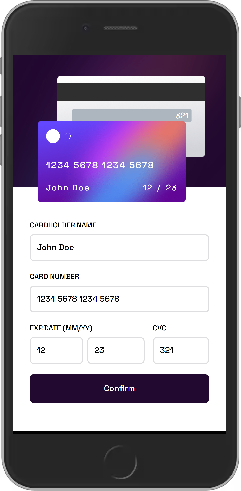

# Frontend Mentor Challenge - Interactive card details form

The challenge was to build out a responsive interactive credit-card form and get it looking as close to the provided design as possible.

[Click here to see the result.](https://bnayakahalani.github.io/interactive-card-details-form-tailwind//)

Tools I used: React, Tailwind and Vite.

Here are some photos of the final product:

 

    
   

    

## What I Learned from this Project?

First, this project presented a unique opportunity to become familiar with the Tailwindcss library and to put its principles into practical application. I enjoyed working with Tailwind and appreciate the benefits it offers in certain projects. However, for others, I would still choose to rely upon the good old Sass.

Second, this project posed a design challenge in terms of responsiveness and positioning, and I was eager to accept it.

Finally, the logic required to validate credit-card forms and avoid missing information was a crucial aspect of this project, and I am proud of the work I accomplished in this regard.

Overall, I had an enjoyable experience with this project and look forward to further challenges presented by Frontend Mentor.
